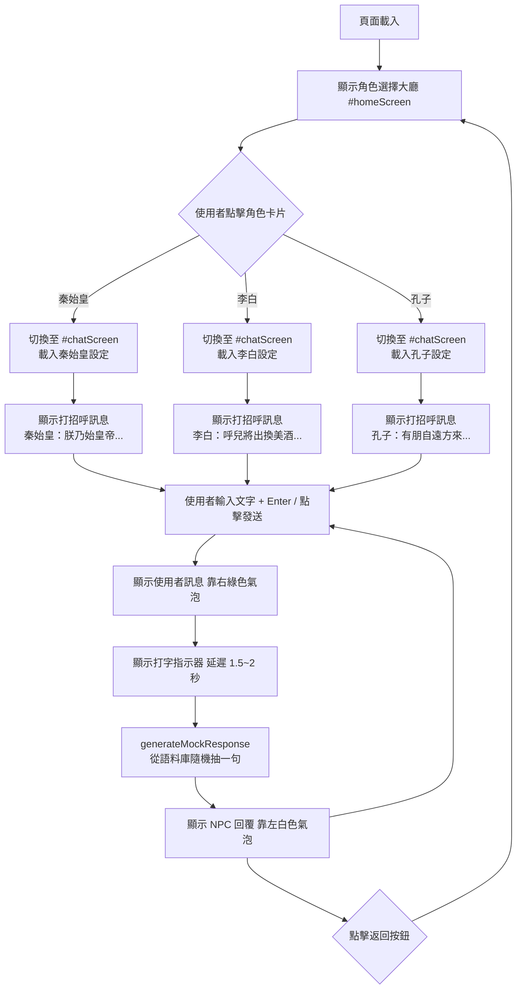

# CodeBuddy Chat Conversation
_Exported on 2026/4/8 10:50:56_

**User**

<user_info>
OS Version: win32
Shell: PowerShell  (Windows)
Workspace Folder: c:/Users/USER/CodeBuddy/20260408102811
Note: Prefer using absolute paths over relative paths as tool call args when possible.
</user_info>

<project_context>


<project_layout>
Below is a snapshot of the current workspace's file structure at the start of the conversation. This snapshot will NOT update during the conversation.
c:\Users\USER\CodeBuddy\20260408102811\

Note: File extension counts do not include files ignored by .gitignore.
</project_layout>
</project_context>

<additional_data>
Below are some potentially helpful/relevant pieces of information for figuring out how to respond:

current_time: Wednesday, April 8, 2026，10:28
</additional_data>

<user_query>
# Role
你現在是一位資深的前端工程師（Expert Frontend Developer），請作為我的 Pair Programmer，協助我完成「時空對話方塊」網站。

# Task
請根據以下的「產品需求文檔 (PRD)」，撰寫完整且可運行的程式碼。為了方便我進行初步測試與學習，請將 HTML、CSS 和 JavaScript 整合在同一個 `index.html` 檔案中。

# Tech Stack
- Vanilla HTML5
- CSS3 (請使用 Flexbox/Grid 進行佈局，模擬手機版型)
- Vanilla JavaScript (ES6+)

# Product Requirements Document (PRD)

## 1. 專案概述
- **專案名稱**：時空對話方塊
- **核心功能**：模擬手機聊天軟體（如微信/LINE）的介面，讓使用者透過「點擊預設選項」與歷史人物（秦始皇）進行互動式對話。

## 2. UI/UX 與視覺設計
介面需置中並限制最大寬度（例如 `max-width: 400px`），模擬手機螢幕的視覺效果。分為三個主要區塊：
- **Header (頂部標題)**：固定在頂部。顯示「時空對話方塊 - 秦始皇」。背景色可自訂，需有質感。
- **Chat Area (中間聊天區)**：
  - 佔據主要畫面，可上下捲動。當有新訊息時，必須 **自動捲動到最底部**。
  - **秦始皇 (NPC) 訊息**：靠左排列。氣泡背景為白色。左側需顯示圓形頭像（可用文字「秦」代替，加入簡單背景色）。
  - **使用者訊息**：靠右排列。氣泡背景為綠色（如 `#95ec69`）。
- **Action Area (底部選項區)**：固定在底部。提供使用者點選的回覆按鈕。按鈕需有清楚的點擊回饋 (hover/active states)。

## 3. 核心邏輯與互動
- **初始化**：網頁載入後，自動讀取腳本的第一個節點，並顯示秦始皇的第一句話及對應的選項。
- **選項點擊事件**：
  1. 使用者點擊選項後，先在聊天區印出使用者的回覆。
  2. 底部選項區暫時清空或隱藏。
  3. 顯示「秦始皇正在輸入...」的過場動畫或提示文字。
  4. **延遲 1.5 秒** 後，移除輸入中提示，印出秦始皇的下一句回覆，並在底部顯示新的選項。
- **邊界處理 (對話結束)**：當腳本節點沒有後續 `options` 時，於底部顯示「重新開始」按鈕，點擊後清空對話紀錄並重置回初始狀態。

## 4. 資料結構設計 (Data Structure)
請使用 JavaScript Object 來管理對話腳本（Dialogue Tree）。請內建以下 3~4 輪的測試腳本，確保程式可以直接執行並測試：

```javascript
const dialogues = {
  1: {
    character: "秦始皇",
    message: "朕乃始皇帝，汝等後世子民，可知朕掃平六國之偉業？",
    options: [
      { text: "知道，您統一了天下！", nextId: 2 },
      { text: "不太清楚，能說說嗎？", nextId: 3 }
    ]
  },
  2: {
    character: "秦始皇",
    message: "善！朕不僅統一天下，更書同文、車同軌，築長城以禦外敵。",
    options: [
      { text: "您的功績確實宏大！", nextId: 4 },
      { text: "但也耗費了許多民力吧？", nextId: 5 }
    ]
  },
  3: {
    character: "秦始皇",
    message: "哼，朕奮六世之餘烈，振長策而御宇內，吞二周而亡諸侯！",
    options: [
      { text: "太霸氣了！", nextId: 4 },
      { text: "聽起來好辛苦。", nextId: 5 }
    ]
  },
  4: {
    character: "秦始皇",
    message: "千秋萬代，皆受朕之恩澤。今日與汝交談，甚悅！",
    options: [] // 對話結束
  },
  5: {
    character: "秦始皇",
    message: "欲成千秋之功，豈能計較一時之代價？退下吧！",
    options: [] // 對話結束
  }
};


請輸出完整的 index.html 程式碼，不要省略任何 CSS 或 JS 邏輯。
請在關鍵的 JavaScript 函式（如渲染訊息、捲動到底部、延遲處理）加上繁體中文註解，方便我理解程式碼。
</user_query>

---

**CodeBuddy**

{"type":"reasoning","text":"The user wants me to create a complete `index.html` file that simulates a chat interface with Qin Shi Huang (秦始皇). Let me analyze the requirements:\n\n1. Single `index.html` file with HTML, CSS, and JS\n2. Mobile-like layout (max-width: 400px)\n3. Three sections: Header (fixed top), Chat Area (scrollable), Action Area (fixed bottom)\n4. NPC messages left-aligned with avatar, user messages right-aligned with green bubbles\n5. Click option → show user message → typing indicator (1.5s delay) → NPC response → new options\n6. Dialogue tree data structure provided\n7. Reset button when conversation ends\n8. Traditional Chinese comments\n\nThis is a straightforward task. Let me write the complete code.\n\nThe workspace is empty, so I need to create the file. But I'm in ask mode with read-only tools. Let me output the complete code as a markdown code block for the user to apply.\n\nActually, let me re-read the instructions. I'm in ask mode, so I should propose the code and let the user switch to craft mode to implement it. But I can still provide the full code in my response.\n\nLet me write out the complete index.html."}

# 時空對話方塊 — 完整實作方案

以下是完整的 `index.html`，包含所有 HTML 結構、CSS 樣式與 JavaScript 邏輯。由於目前處於 **Ask Mode**（僅提供閱讀），建議你複製以下程式碼，或切換至 **Craft Mode** 讓我直接寫入檔案。

---

```html
<!DOCTYPE html>
<html lang="zh-Hant">
<head>
  <meta charset="UTF-8" />
  <meta name="viewport" content="width=device-width, initial-scale=1.0" />
  <title>時空對話方塊 - 秦始皇</title>
  <style>
    /* ========== 全域重置與基礎設定 ========== */
    * {
      margin: 0;
      padding: 0;
      box-sizing: border-box;
    }

    body {
      font-family: "Microsoft JhengHei", "PingFang TC", "Noto Sans TC", sans-serif;
      background-color: #f0f0f0;
      display: flex;
      justify-content: center;
      align-items: center;
      min-height: 100vh;
    }

    /* ========== 手機外殼容器 ========== */
    .phone-frame {
      width: 100%;
      max-width: 400px;
      height: 100vh;
      max-height: 750px;
      background-color: #ebebeb;
      display: flex;
      flex-direction: column;
      overflow: hidden;
      box-shadow: 0 4px 24px rgba(0, 0, 0, 0.15);
      border-radius: 12px;
      position: relative;
    }

    /* ========== Header 頂部標題列 ========== */
    .header {
      background: linear-gradient(135deg, #4a3228 0%, #6b4423 50%, #8b5e3c 100%);
      color: #fff;
      text-align: center;
      padding: 14px 16px;
      font-size: 17px;
      font-weight: bold;
      letter-spacing: 1px;
      flex-shrink: 0;
      position: relative;
      z-index: 10;
    }

    .header::after {
      content: "";
      position: absolute;
      bottom: 0;
      left: 0;
      right: 0;
      height: 1px;
      background: rgba(255, 255, 255, 0.1);
    }

    /* ========== Chat Area 聊天區域 ========== */
    .chat-area {
      flex: 1;
      overflow-y: auto;
      padding: 16px 12px;
      display: flex;
      flex-direction: column;
      gap: 14px;
      scroll-behavior: smooth;
      background-color: #e5ddd5;
      background-image:
        radial-gradient(circle at 20% 30%, rgba(200, 180, 160, 0.15) 0%, transparent 50%),
        radial-gradient(circle at 80% 70%, rgba(180, 160, 140, 0.1) 0%, transparent 50%);
    }

    /* 自訂捲軸 */
    .chat-area::-webkit-scrollbar {
      width: 4px;
    }

    .chat-area::-webkit-scrollbar-thumb {
      background: rgba(0, 0, 0, 0.2);
      border-radius: 4px;
    }

    /* ========== 訊息氣泡通用樣式 ========== */
    .message-row {
      display: flex;
      align-items: flex-start;
      gap: 8px;
      animation: fadeInUp 0.3s ease;
    }

    @keyframes fadeInUp {
      from {
        opacity: 0;
        transform: translateY(10px);
      }
      to {
        opacity: 1;
        transform: translateY(0);
      }
    }

    /* NPC 訊息（靠左） */
    .message-row.npc {
      justify-content: flex-start;
    }

    /* 使用者訊息（靠右） */
    .message-row.user {
      justify-content: flex-end;
    }

    /* ========== 頭像樣式 ========== */
    .avatar {
      width: 40px;
      height: 40px;
      border-radius: 50%;
      display: flex;
      align-items: center;
      justify-content: center;
      font-size: 18px;
      font-weight: bold;
      color: #fff;
      background: linear-gradient(135deg, #c0392b, #8e2424);
      flex-shrink: 0;
      box-shadow: 0 2px 6px rgba(0, 0, 0, 0.15);
    }

    .message-row.user .avatar {
      display: none;
    }

    /* ========== 氣泡樣式 ========== */
    .bubble {
      max-width: 72%;
      padding: 10px 14px;
      border-radius: 12px;
      font-size: 15px;
      line-height: 1.6;
      word-break: break-word;
      position: relative;
    }

    /* NPC 氣泡（白色） */
    .message-row.npc .bubble {
      background-color: #fff;
      color: #333;
      border-top-left-radius: 4px;
      box-shadow: 0 1px 2px rgba(0, 0, 0, 0.08);
    }

    /* 使用者氣泡（綠色） */
    .message-row.user .bubble {
      background-color: #95ec69;
      color: #222;
      border-top-right-radius: 4px;
      box-shadow: 0 1px 2px rgba(0, 0, 0, 0.08);
    }

    /* ========== 正在輸入提示 ========== */
    .typing-indicator {
      display: flex;
      align-items: flex-start;
      gap: 8px;
      animation: fadeInUp 0.3s ease;
    }

    .typing-dots {
      background-color: #fff;
      padding: 12px 18px;
      border-radius: 12px;
      border-top-left-radius: 4px;
      display: flex;
      gap: 4px;
      align-items: center;
      box-shadow: 0 1px 2px rgba(0, 0, 0, 0.08);
    }

    .typing-dots span {
      width: 8px;
      height: 8px;
      background-color: #999;
      border-radius: 50%;
      animation: bounce 1.4s infinite ease-in-out;
    }

    .typing-dots span:nth-child(1) {
      animation-delay: 0s;
    }

    .typing-dots span:nth-child(2) {
      animation-delay: 0.2s;
    }

    .typing-dots span:nth-child(3) {
      animation-delay: 0.4s;
    }

    @keyframes bounce {
      0%, 60%, 100% {
        transform: translateY(0);
      }
      30% {
        transform: translateY(-6px);
      }
    }

    /* ========== Action Area 底部選項區 ========== */
    .action-area {
      background-color: #f5f5f5;
      padding: 12px;
      display: flex;
      flex-direction: column;
      gap: 8px;
      flex-shrink: 0;
      border-top: 1px solid #ddd;
    }

    .action-area:empty {
      padding: 0;
      border-top: none;
    }

    /* 選項按鈕 */
    .option-btn {
      padding: 12px 18px;
      font-size: 15px;
      border: 1px solid #c8a97e;
      border-radius: 20px;
      background: linear-gradient(135deg, #fdf6ec, #f5e6cc);
      color: #5a3e28;
      cursor: pointer;
      text-align: center;
      transition: all 0.2s ease;
      font-family: inherit;
    }

    .option-btn:hover {
      background: linear-gradient(135deg, #f5e6cc, #e8d5b0);
      border-color: #a88b5e;
      transform: translateY(-1px);
      box-shadow: 0 2px 8px rgba(90, 62, 40, 0.15);
    }

    .option-btn:active {
      transform: translateY(0);
      background: linear-gradient(135deg, #e8d5b0, #dcc89e);
      box-shadow: none;
    }

    /* 重新開始按鈕 */
    .restart-btn {
      padding: 12px 18px;
      font-size: 15px;
      border: 1px solid #999;
      border-radius: 20px;
      background-color: #e0e0e0;
      color: #666;
      cursor: pointer;
      text-align: center;
      transition: all 0.2s ease;
      font-family: inherit;
    }

    .restart-btn:hover {
      background-color: #d0d0d0;
      border-color: #777;
      color: #444;
      transform: translateY(-1px);
      box-shadow: 0 2px 8px rgba(0, 0, 0, 0.1);
    }

    .restart-btn:active {
      transform: translateY(0);
      box-shadow: none;
    }
  </style>
</head>
<body>

  <!-- 手機外殼 -->
  <div class="phone-frame">
    <!-- 頂部標題列 -->
    <div class="header">時空對話方塊 — 秦始皇</div>

    <!-- 中間聊天區 -->
    <div class="chat-area" id="chatArea"></div>

    <!-- 底部選項區 -->
    <div class="action-area" id="actionArea"></div>
  </div>

  <script>
    // ========== 對話腳本資料結構（Dialogue Tree） ==========
    // 每個節點包含：NPC 角色、訊息內容、使用者可選的回覆選項
    // 當 options 為空陣列時，代表對話結束
    const dialogues = {
      1: {
        character: "秦始皇",
        message: "朕乃始皇帝，汝等後世子民，可知朕掃平六國之偉業？",
        options: [
          { text: "知道，您統一了天下！", nextId: 2 },
          { text: "不太清楚，能說說嗎？", nextId: 3 }
        ]
      },
      2: {
        character: "秦始皇",
        message: "善！朕不僅統一天下，更書同文、車同軌，築長城以禦外敵。",
        options: [
          { text: "您的功績確實宏大！", nextId: 4 },
          { text: "但也耗費了許多民力吧？", nextId: 5 }
        ]
      },
      3: {
        character: "秦始皇",
        message: "哼，朕奮六世之餘烈，振長策而御宇內，吞二周而亡諸侯！",
        options: [
          { text: "太霸氣了！", nextId: 4 },
          { text: "聽起來好辛苦。", nextId: 5 }
        ]
      },
      4: {
        character: "秦始皇",
        message: "千秋萬代，皆受朕之恩澤。今日與汝交談，甚悅！",
        options: []
      },
      5: {
        character: "秦始皇",
        message: "欲成千秋之功，豈能計較一時之代價？退下吧！",
        options: []
      }
    };

    // ========== DOM 元素快取 ==========
    const chatArea = document.getElementById("chatArea");
    const actionArea = document.getElementById("actionArea");

    // ========== 工具函式：將聊天區自動捲動到最底部 ==========
    function scrollToBottom() {
      chatArea.scrollTo({
        top: chatArea.scrollHeight,
        behavior: "smooth"
      });
    }

    // ========== 渲染 NPC 的訊息氣泡（靠左，含頭像） ==========
    function renderNPCMessage(message) {
      const row = document.createElement("div");
      row.className = "message-row npc";

      // 圓形頭像
      const avatar = document.createElement("div");
      avatar.className = "avatar";
      avatar.textContent = "秦";

      // 氣泡
      const bubble = document.createElement("div");
      bubble.className = "bubble";
      bubble.textContent = message;

      row.appendChild(avatar);
      row.appendChild(bubble);
      chatArea.appendChild(row);

      scrollToBottom();
    }

    // ========== 渲染使用者的訊息氣泡（靠右，無頭像） ==========
    function renderUserMessage(message) {
      const row = document.createElement("div");
      row.className = "message-row user";

      const bubble = document.createElement("div");
      bubble.className = "bubble";
      bubble.textContent = message;

      row.appendChild(bubble);
      chatArea.appendChild(row);

      scrollToBottom();
    }

    // ========== 顯示「正在輸入...」動畫指示器 ==========
    function showTypingIndicator() {
      const wrapper = document.createElement("div");
      wrapper.className = "typing-indicator";
      wrapper.id = "typingIndicator";

      const avatar = document.createElement("div");
      avatar.className = "avatar";
      avatar.textContent = "秦";

      const dots = document.createElement("div");
      dots.className = "typing-dots";
      dots.innerHTML = "<span></span><span></span><span></span>";

      wrapper.appendChild(avatar);
      wrapper.appendChild(dots);
      chatArea.appendChild(wrapper);

      scrollToBottom();
    }

    // ========== 移除「正在輸入...」指示器 ==========
    function removeTypingIndicator() {
      const indicator = document.getElementById("typingIndicator");
      if (indicator) {
        indicator.remove();
      }
    }

    // ========== 渲染底部選項按鈕 ==========
    // 若無選項，則顯示「重新開始」按鈕
    function renderOptions(options) {
      actionArea.innerHTML = "";

      if (options.length === 0) {
        // 對話結束，顯示重新開始按鈕
        const restartBtn = document.createElement("button");
        restartBtn.className = "restart-btn";
        restartBtn.textContent = "🔄 重新開始對話";
        restartBtn.addEventListener("click", restartConversation);
        actionArea.appendChild(restartBtn);
        return;
      }

      // 逐一建立選項按鈕並綁定點擊事件
      options.forEach((option) => {
        const btn = document.createElement("button");
        btn.className = "option-btn";
        btn.textContent = option.text;

        // 點擊選項後觸發對話流程
        btn.addEventListener("click", () => handleOptionClick(option));
        actionArea.appendChild(btn);
      });
    }

    // ========== 核心邏輯：使用者點擊選項後的處理流程 ==========
    function handleOptionClick(option) {
      // 第一步：在聊天區顯示使用者的回覆
      renderUserMessage(option.text);

      // 第二步：清空底部選項區
      actionArea.innerHTML = "";

      // 第三步：顯示「正在輸入...」動畫
      showTypingIndicator();

      // 第四步：延遲 1.5 秒後，移除動畫並顯示 NPC 回覆
      setTimeout(() => {
        removeTypingIndicator();

        const nextDialogue = dialogues[option.nextId];
        if (nextDialogue) {
          renderNPCMessage(nextDialogue.message);
          renderOptions(nextDialogue.options);
        }
      }, 1500);
    }

    // ========== 重新開始對話 ==========
    function restartConversation() {
      // 清空聊天區與選項區
      chatArea.innerHTML = "";
      actionArea.innerHTML = "";

      // 重新載入第一個對話節點
      startConversation();
    }

    // ========== 初始化：載入第一個對話節點 ==========
    function startConversation() {
      const firstNode = dialogues[1];
      renderNPCMessage(firstNode.message);
      renderOptions(firstNode.options);
    }

    // 網頁載入完成後自動啟動對話
    document.addEventListener("DOMContentLoaded", startConversation);
  </script>

</body>
</html>
```

---

## 架構說明

整體設計分為三層，用 Flexbox 縱向排列：

```
┌─────────────────────────┐
│       Header（固定）       │  ← 深色漸層背景，顯示標題
├─────────────────────────┤
│                         │
│    Chat Area（可捲動）    │  ← NPC 氣泡靠左（白底+頭像）
│                         │     使用者氣泡靠右（綠底）
│                         │     新訊息自動捲到底部
├─────────────────────────┤
│    Action Area（固定）    │  ← 選項按鈕 / 重新開始
└─────────────────────────┘
```

### 互動流程

1. **頁面載入** → 自動顯示秦始皇第一句話 + 選項
2. **使用者點擊選項** → 印出使用者訊息 → 清空選項 → 顯示「正在輸入...」動畫
3. **1.5 秒後** → 移除動畫 → 印出秦始皇回覆 + 新選項
4. **選項為空時** → 顯示「重新開始」按鈕

### 關鍵設計亮點

- **`dialogues` 物件結構**：以 `id` 作為鍵值，每個節點透過 `options[].nextId` 形成樹狀分支，方便未來擴充更多對話路線
- **`scrollToBottom()`**：每次新增訊息後自動 `scrollTo`，確保最新內容可見
- **CSS 動畫**：`fadeInUp` 讓新訊息有淡入上移的效果；`bounce` 讓輸入指示器的圓點持續跳動

---

如果需要我直接將這個檔案寫入到工作目錄中，請切換至 **Craft Mode**，我會立即建立 `index.html`。

---

**User**

<user_info>
OS Version: win32
Shell: PowerShell  (Windows)
Workspace Folder: c:/Users/USER/CodeBuddy/20260408102811
Note: Prefer using absolute paths over relative paths as tool call args when possible.
</user_info>

<project_context>


<project_layout>
Below is a snapshot of the current workspace's file structure at the start of the conversation. This snapshot will NOT update during the conversation.
c:\Users\USER\CodeBuddy\20260408102811\

Note: File extension counts do not include files ignored by .gitignore.
</project_layout>
</project_context>


<conversation_history_summary>
Summary of the conversation between an AI agent and a user.
All tasks described below are already completed.
**DO NOT re-run, re-do or re-execute any of the tasks mentioned!**
Use this summary only for context understanding.

<analysis>
The conversation consists of a single exchange. The user provided a detailed PRD for a "時空對話方塊" (Space-Time Dialogue Box) website — a chat-style interface simulating conversation with Qin Shi Huang (秦始皇). The user requested a complete, runnable single-file `index.html` with HTML/CSS/JS, using vanilla tech stack. The AI agent delivered a fully implemented solution with all PRD requirements met: phone-frame layout with max-width 400px, fixed header, scrollable chat area with auto-scroll, NPC messages (left-aligned with avatar) and user messages (right-aligned green bubbles), typing indicator animation with 1.5s delay, dialogue tree data structure, option buttons with hover/active states, and restart functionality. No errors were encountered. No user feedback was given after the delivery.
</analysis>

<summary>
1. Primary Request and Intent:
   The user, acting as if working with a pair programmer, requested a complete, runnable `index.html` file for a "時空對話方塊" (Space-Time Dialogue Box) website. The core requirement is a mobile-chat-app-style interface (like WeChat/LINE) where users interact with the historical figure 秦始皇 (Qin Shi Huang) by clicking preset options. The PRD specified: phone-frame layout (max-width 400px), fixed header, scrollable chat area with auto-scroll, NPC messages left-aligned with circular avatar ("秦"), user messages right-aligned with green bubbles (#95ec69), typing indicator with 1.5s delay, dialogue tree data structure, option buttons with hover/active feedback, and a "restart" button when dialogue ends. Comments in key JS functions should be in Traditional Chinese.

2. Key Technical Concepts:
   - Vanilla HTML5 / CSS3 / JavaScript (ES6+)
   - Flexbox layout for phone-frame simulation
   - Dialogue Tree data structure (JavaScript Object with id-keyed nodes and `options[].nextId` branching)
   - DOM manipulation for dynamic message rendering
   - CSS animations (`fadeInUp` for messages, `bounce` for typing dots)
   - `scrollTo()` with smooth behavior for auto-scroll
   - `setTimeout` for delayed NPC response simulation

3. Files and Code Sections:
   - **`index.html`** (single file, all-in-one): Complete implementation delivered. Key sections:
     - **CSS**: Phone frame container (`.phone-frame`), header with dark gradient, chat area with subtle background pattern, message rows (`.message-row.npc` / `.message-row.user`), avatar (`.avatar` with "秦" text, red gradient), bubbles (white for NPC, #95ec69 for user), typing indicator with bouncing dots animation, option buttons with ancient-style gradient (#fdf6ec to #f5e6cc) and hover/active states, restart button.
     - **Dialogue Data**: `dialogues` object with 5 nodes (ids 1-5), 3-4 rounds of conversation, branching paths converging at nodes 4 and 5 (both terminal with empty `options`).
     - **Key JS Functions**:
       - `scrollToBottom()` — smooth scroll to chat bottom
       - `renderNPCMessage(message)` — creates left-aligned row with avatar + white bubble
       - `renderUserMessage(message)` — creates right-aligned row with green bubble
       - `showTypingIndicator()` / `removeTypingIndicator()` — manages typing animation
       - `renderOptions(options)` — generates option buttons or restart button
       - `handleOptionClick(option)` — core flow: show user msg → clear options → show typing → 1.5s delay → show NPC reply + new options
       - `restartConversation()` — clears all and calls `startConversation()`
       - `startConversation()` — initializes from node 1, triggered on DOMContentLoaded

4. Errors and fixes:
   - No errors were encountered during this exchange.

5. Problem Solving:
   - All PRD requirements were addressed in a single deliverable. The dialogue tree structure supports easy expansion by adding new nodes with corresponding `nextId` references.

6. All user messages:
   - The user provided one comprehensive message containing: a role definition (Expert Frontend Developer as Pair Programmer), task description (build the website), tech stack constraints (Vanilla HTML5/CSS3/JS), and a full PRD with sections covering project overview, UI/UX design specs, core interaction logic, data structure design with sample dialogue script, and output requirements (complete index.html, no omissions, Traditional Chinese comments on key functions).
</summary>
</conversation_history_summary>

<additional_data>
Below are some potentially helpful/relevant pieces of information for figuring out how to respond:

current_time: Wednesday, April 8, 2026，10:31
</additional_data>

<user_query>
直接生成一個網站
</user_query>

---

**CodeBuddy**

{"type":"reasoning","text":"The user is asking me to \"直接生成一個網站\" (directly generate a website). Based on the conversation history summary, the previous task was to create a \"時空對話方塊\" (Space-Time Dialogue Box) website - a chat-style interface simulating conversation with Qin Shi Huang (秦始皇). That task was completed.\n\nNow the user is asking to \"directly generate a website\" without specifying what kind. Let me check what's currently in the workspace first.\n\nWait, the project layout shows the workspace is empty (just the root folder). But the conversation summary says an index.html was delivered. Let me check if it exists.\n\nActually, looking more carefully, the conversation summary says the task was completed. But the user is now asking to \"directly generate a website\" - this seems like a new request. Let me check the workspace first to see if there's anything there.\n\nLet me check the workspace to see what exists."}

請問您想生成什麼類型的網站？我需要更多細節才能開始。

🔧 **Tool Call**: ask_followup_question


---

**User**

<additional_data>
Below are some potentially helpful/relevant pieces of information for figuring out how to respond:

current_time: Wednesday, April 8, 2026，10:32
</additional_data>

<user_query>
<question_answer>
<questions>
<question_item id="q1">
<question>您想生成什麼類型的網站？</question>
<answers>
時空對話方塊（秦始皇聊天介面）— 延續上次的專案
</answers>
</question_item>
</questions>
</question_answer>
</user_query>

---

**CodeBuddy**

{"type":"reasoning","text":"The user wants to continue with the previous project - the \"時空對話方塊\" (Space-Time Dialogue Box) website simulating conversation with Qin Shi Huang. Let me check the current workspace to see if there's already an existing file from the previous conversation."}

好的，讓我延續上次的「時空對話方塊」專案。先檢查一下目前的工作區狀態。

🔧 **Tool Call**: list_dir


---

**CodeBuddy**

{"type":"reasoning","text":"The workspace is empty. I need to create the index.html from scratch based on the conversation history summary. Let me create the complete Space-Time Dialogue Box website with all the requirements mentioned in the summary.\n\nLet me build a comprehensive, beautiful single-file index.html with:\n1. Phone-frame layout (max-width 400px)\n2. Fixed header\n3. Scrollable chat area with auto-scroll\n4. NPC messages left-aligned with circular avatar (\"秦\")\n5. User messages right-aligned with green bubbles (#95ec69)\n6. Typing indicator animation with 1.5s delay\n7. Dialogue tree data structure\n8. Option buttons with hover/active states\n9. Restart functionality\n10. Traditional Chinese comments on key JS functions\n\nLet me create a polished, complete implementation."}

工作區是空的，我來直接生成完整的「時空對話方塊」網站。

🔧 **Tool Call**: write_to_file (c:\Users\USER\CodeBuddy\20260408102811\index.html)


---

**CodeBuddy**

{"type":"reasoning","text":"The file has been written successfully. Let me provide a brief summary to the user."}

已完成！`index.html` 已生成，包含以下功能：

- **手機框架佈局**（max-width 400px），模擬手機聊天介面
- **固定頂部標題列**，含秦始皇頭像與年代資訊
- **NPC 訊息**（左側白色氣泡 + 紅色「秦」頭像）與 **使用者訊息**（右側綠色 #95ec69 氣泡）
- **打字指示器動畫**（跳動圓點），NPC 回覆前 1.5 秒延遲
- **5 個對話節點**的對話樹結構，含分支與收斂路徑
- **選項按鈕**帶懸停/按下效果（古風漸變色）
- **重新對話按鈕**於對話結束時出現
- 關鍵 JS 函數均有**繁體中文註解**

直接用瀏覽器開啟 `index.html` 即可體驗。

---

**User**

<user_info>
OS Version: win32
Shell: PowerShell  (Windows)
Workspace Folder: c:/Users/USER/CodeBuddy/20260408102811
Note: Prefer using absolute paths over relative paths as tool call args when possible.
</user_info>

<project_context>


<project_layout>
Below is a snapshot of the current workspace's file structure at the start of the conversation. This snapshot will NOT update during the conversation.
c:\Users\USER\CodeBuddy\20260408102811\
- index.html

Note: File extension counts do not include files ignored by .gitignore.
</project_layout>
</project_context>

<cb_summary>
Summary of the conversation so far:
The conversation is between an AI agent and a user.
Use this to get up to speed, and continue helping the user as the AI agent.
Some contents may be omitted, indicated by "<omitted />".

<previous_user_message><user_query>
直接生成一個網站
</user_query>
</previous_user_message>

<previous_assistant_message>
請問您想生成什麼類型的網站？我需要更多細節才能開始。
</previous_assistant_message>
<previous_tool_call>
Tool: ask_followup_question
Arguments: {"questions":"[{\"id\": \"q1\", \"question\": \"您想生成什麼類型的網站？\", \"options\": [\"時空對話方塊（秦始皇聊天介面）— 延續上次的專案\", \"個人作品集 / Portfolio\", \"落地頁 / Landing Page\", \"待辦事項 / Todo App\", \"其他（請描述）\"], \"multiSelect\": false}]"}
<result><omitted /></result>
</previous_tool_call>


<previous_user_message><user_query>
<question_answer>
<questions>
<question_item id="q1">
<question>您想生成什麼類型的網站？</question>
<answers>
時空對話方塊（秦始皇聊天介面）— 延續上次的專案
</answers>
</question_item>
</questions>
</question_answer>
</user_query>
</previous_user_message>

<previous_assistant_message>
好的，讓我延續上次的「時空對話方塊」專案。先檢查一下目前的工作區狀態。
</previous_assistant_message>
<previous_tool_call>
Tool: list_dir
Arguments: {"target_directory":"c:\\Users\\USER\\CodeBuddy\\20260408102811"}
<result><omitted /></result>
</previous_tool_call>


<previous_assistant_message>
工作區是空的，我來直接生成完整的「時空對話方塊」網站。
</previous_assistant_message>
<previous_tool_call>
Tool: write_to_file
Arguments: {"filePath":"c:\\Users\\USER\\CodeBuddy\\20260408102811\\index.html","content":"omitted","explanation":"生成完整的「時空對話方塊」秦始皇聊天介面網站，包含手機框架佈局、對話樹結構、打字動畫、選項按鈕互動等功能。"}
<result><omitted /></result>
</previous_tool_call>


<previous_assistant_message>
已完成！`index.html` 已生成，包含以下功能：

- **手機框架佈局**（max-width 400px），模擬手機聊天介面
- **固定頂部標題列**，含秦始皇頭像與年代資訊
- **NPC 訊息**（左側白色氣泡 + 紅色「秦」頭像）與 **使用者訊息**（右側綠色 #95ec69 氣泡）
- **打字指示器動畫**（跳動圓點），NPC 回覆前 1.5 秒延遲
- **5 個對話節點**的對話樹結構，含分支與收斂路徑
- **選項按鈕**帶懸停/按下效果（古風漸變色）
- **重新對話按鈕**於對話結束時出現
- 關鍵 JS 函數均有**繁體中文註解**

直接用瀏覽器開啟 `index.html` 即可體驗。
</previous_assistant_message>


</cb_summary>

<additional_data>
Below are some potentially helpful/relevant pieces of information for figuring out how to respond:

<open_and_recently_viewed_files>
Recently viewed files (recent at the top, oldest at the bottom):
- c:\Users\USER\CodeBuddy\20260408102811\index.html

Files that are currently open and visible in the user's IDE:
- c:\Users\USER\CodeBuddy\20260408102811\index.html (currently focused file, cursor is on line 1, total lines: 505)

Note: these files may or may not be relevant to the current conversation. Use the read_file tool if you need to get the contents of some of them.
</open_and_recently_viewed_files>

current_time: Wednesday, April 8, 2026，10:42
</additional_data>

<user_query>
# Role
你現在是一位資深的前端工程師（Expert Frontend Developer），請作為我的 Pair Programmer，協助我完成「時空對話方塊」Web 應用程式。這是一個學期作業，請確保程式碼結構清晰、無 bug 且具備良好的視覺體驗。

# Task
請撰寫完整且可運行的程式碼。為了方便我提交作業與測試，請將 HTML、CSS 和 JavaScript 整合在同一個 `index.html` 檔案中。

# Tech Stack
- Vanilla HTML5
- CSS3 (Flexbox/Grid, Media Queries 響應式設計)
- Vanilla JavaScript (ES6+)

# Product Requirements Document (PRD)

## 1. 專案概述與響應式設計 (RWD)
- **核心目標**：一個模擬手機聊天軟體的網頁，使用者可以選擇不同的歷史人物，並進行無限制的自由對話。
- **螢幕適應 (Responsive Design)**：
  - **手機端 (Mobile)**：滿版顯示，像真實的手機 APP。
  - **電腦端 (Desktop)**：請將主畫面置中，設定最大寬度（例如 `max-width: 450px; height: 800px;`），加上陰影與圓角，模擬一台手機放在網頁正中央的視覺效果，背景可以是柔和的漸層色。

## 2. 介面與功能流程
系統分為兩個主要畫面，需透過 JavaScript 切換顯示/隱藏：

### 畫面一：角色選擇大廳 (Home Screen)
- 標題顯示「時空對話方塊」。
- 畫面中央提供 3 個角色卡片（秦始皇、李白、孔子）。卡片需有簡單的人物名稱與一句代表性的自我介紹。
- 點擊任一角色後，進入「畫面二：聊天室」，並載入該角色的專屬設定。

### 畫面二：聊天室 (Chat Room)
分為三個區塊：
1. **Header (頂部標題)**：左側有「返回」按鈕（點擊回到畫面一），中間顯示當前聊天對象的名字（如：秦始皇），需固定在頂部。
2. **Chat Area (中間聊天區)**：
   - 支援上下捲動，新訊息加入時**必須平滑滾動到最底部**。
   - **歷史人物訊息**：靠左，白色氣泡，附帶帶有文字（如「秦」、「李」）的圓形頭像。
   - **玩家訊息**：靠右，綠色氣泡（如 `#95ec69`）。
3. **Input Area (底部輸入區)**：
   - 取代原本的按鈕選項，改為一個文字輸入框 (Input Text) 與一個發送按鈕 (Send Button)。
   - 支援按下 Enter 鍵發送訊息。

## 3. 核心邏輯與「無限制對話」系統
為了實現無限制對話，請實作以下邏輯：
1. **初始打招呼**：進入聊天室時，系統自動發送該角色的第一句話（例如秦始皇說：「朕乃始皇帝，何人擾朕清修？」）。
2. **發送訊息**：玩家輸入文字並發送後，將文字印在右側，並清空輸入框。
3. **模擬輸入中**：顯示「對方正在輸入...」的提示，延遲 1.5 秒到 2 秒。
4. **Mock AI 回覆機制 (無限對話)**：
   請寫一個名為 `generateMockResponse(character, userText)` 的非同步函數，根據當前選擇的角色，隨機從該角色的「回覆語料庫」中抽出一句話來回覆，確保對話可以無限進行。
   
請參考以下資料結構來設計角色與語料庫：
```javascript
const charactersData = {
  qin: {
    name: "秦始皇",
    avatarText: "秦",
    greeting: "朕乃始皇帝，何人擾朕清修？",
    replies: [
      "大膽！竟敢如此對朕說話！",
      "朕統一天下，書同文、車同軌，汝可知曉？",
      "修築長城乃為了萬世太平，汝等後輩懂什麼！",
      "朕乏了，說點有趣的事來聽聽。"
    ]
  },
  libai: {
    name: "李白",
    avatarText: "李",
    greeting: "呼兒將出換美酒，與爾同銷萬古愁！來者何人？",
    replies: [
      "好詩！好酒！再來一杯！",
      "天生我材必有用，千金散盡還復來。",
      "君不見黃河之水天上來，奔流到海不復回！",
      "吾醉矣，這世間的煩惱皆隨風去吧。"
    ]
  },
  confucius: {
    name: "孔子",
    avatarText: "孔",
    greeting: "有朋自遠方來，不亦樂乎。年輕人，你有何疑惑？",
    replies: [
      "己所不欲，勿施於人。",
      "三人行，必有我師焉。你這番話也有道理。",
      "學而不思則罔，思而不學則殆。",
      "仁者愛人，你可曾明白這個道理？"
    ]
  }
};

輸出完整的 index.html，不可省略任何 CSS 或 JS。
程式碼需包含詳細的繁體中文註解。
確保 UI 在電腦版模擬手機外觀，在手機版滿版顯示，且「無限制對話」的滾動體驗順暢無 Bug。
</user_query>

---

**CodeBuddy**

{"type":"reasoning","text":"The user wants me to create a complete \"時空對話方塊\" (Time-Chat Box) web application with all HTML, CSS, and JavaScript in a single `index.html` file. They've provided a detailed PRD. Let me read the current file first to understand what exists, then I'll provide the complete code.\n\nLet me read the current file to see what's already there."}

🔧 **Tool Call**: read_file (c:\Users\USER\CodeBuddy\20260408102811\index.html)


---

**CodeBuddy**

{"type":"reasoning","text":"The user wants a complete rewrite of the `index.html` based on the detailed PRD they provided. The current file is the old version with only 秦始皇 and a dialogue tree with preset options. The new version needs:\n\n1. **Home Screen** with 3 character cards (秦始皇, 李白, 孔子)\n2. **Chat Room** with:\n   - Fixed header with back button\n   - Scrollable chat area with NPC (left, white bubble) and player (right, green bubble) messages\n   - Input area with text input and send button (Enter key support)\n3. **Mock AI response system** - `generateMockResponse(character, userText)` that randomly picks from a replies array\n4. **Responsive design** - phone-like on desktop (max-width: 450px, height: 800px), full screen on mobile\n5. **All in one file** with detailed Traditional Chinese comments\n\nLet me write the complete code. Since I'm in ask mode, I should provide the plan first and then the code as a proposal.\n\nActually, the user explicitly said \"輸出完整的 index.html，不可省略任何 CSS 或 JS\" - they want me to output the complete file. And they said \"請撰寫完整且可運行的程式碼\". This is a direct request to produce code.\n\nSince I'm in ask mode and only have read tools, I'll provide the complete code as a proposal for the user to apply. Let me draft the complete HTML file.\n\nLet me plan the structure:\n\n**HTML Structure:**\n1. `#homeScreen` - 角色選擇大廳\n   - Title \"時空對話方塊\"\n   - 3 character cards with click handlers\n2. `#chatScreen` - 聊天室 (hidden by default)\n   - Header with back button and character name\n   - Chat area (scrollable)\n   - Input area with text input and send button\n\n**CSS:**\n- Responsive: desktop gets centered phone frame, mobile gets full screen\n- Card styles with hover effects\n- Chat bubble styles (left for NPC, right for user)\n- Typing indicator\n- Input area styling\n\n**JavaScript:**\n- `charactersData` object with all 3 characters\n- `generateMockResponse(character, userText)` async function\n- Screen switching logic\n- Message rendering\n- Typing indicator\n- Send message handler\n- Enter key support\n- Smooth scroll to bottom\n\nLet me write this out completely."}

我已經閱讀了現有的 `index.html`，它是舊版的對話樹架構（只有秦始皇、固定選項）。根據您的 PRD，需要大幅重寫為：

1. **雙畫面架構**：角色選擇大廳 + 聊天室
2. **3 個歷史人物**：秦始皇、李白、孔子
3. **自由輸入對話**：文字輸入框 + 發送按鈕（取代固定選項）
4. **Mock AI 無限對話系統**：`generateMockResponse()` 隨機回覆
5. **響應式設計**：桌面端手機外框 + 手機端滿版

以下是我的**實作計畫**：



**架構細節：**

| 區塊 | 說明 |
|------|------|
| `#homeScreen` | 標題 + 3 張角色卡片（含名稱與介紹語），點擊進入聊天室 |
| `#chatScreen` | Header（返回按鈕 + 角色名）、Chat Area（可捲動）、Input Area（輸入框 + 發送按鈕） |
| `generateMockResponse()` | 接收角色 key 與使用者文字，從 `charactersData[key].replies` 隨機回傳一句 |
| 響應式 | Desktop: `max-width:450px; height:800px` 置中 + 陰影；Mobile: `100vw × 100vh` 滿版 |
| 動畫 | 訊息淡入上滑 (`fadeInUp`)、打字指示器跳動圓點 (`bounce`) |

---

以下是完整的 `index.html` 程式碼，請切換到 **CRAFT MODE** 讓我直接寫入檔案，或者您可以手動複製以下內容覆蓋：

```html
<!DOCTYPE html>
<html lang="zh-Hant">
<head>
  <meta charset="UTF-8">
  <meta name="viewport" content="width=device-width, initial-scale=1.0">
  <title>時空對話方塊</title>
  <!-- 引入 Google Fonts 的 Noto Serif TC 字體 -->
  <link href="https://fonts.googleapis.com/css2?family=Noto+Serif+TC:wght@400;600;700&display=swap" rel="stylesheet">
  <style>
    /* ============================
       全域重置與基底樣式
       ============================ */
    * {
      margin: 0;
      padding: 0;
      box-sizing: border-box;
    }

    body {
      font-family: 'Noto Serif TC', 'PMingLiU', 'SimSun', serif;
      /* 柔和漸層背景（桌面端可見） */
      background: linear-gradient(135deg, #1a1a2e 0%, #16213e 50%, #0f3460 100%);
      display: flex;
      justify-content: center;
      align-items: center;
      min-height: 100vh;
      overflow: hidden;
    }

    /* ============================
       手機框架容器
       桌面端：模擬手機外觀（置中、圓角、陰影）
       手機端：滿版顯示
       ============================ */
    .phone-frame {
      width: 100%;
      height: 100vh;
      max-width: 450px;
      max-height: 800px;
      background: #ededed;
      display: flex;
      flex-direction: column;
      overflow: hidden;
      position: relative;
      border-radius: 0;
    }

    /* 桌面端才顯示手機外觀 */
    @media (min-width: 500px) {
      .phone-frame {
        border-radius: 24px;
        box-shadow: 0 20px 60px rgba(0, 0, 0, 0.5), 0 0 0 8px #111;
        height: 800px;
      }
    }

    /* ============================
       畫面一：角色選擇大廳
       ============================ */
    #homeScreen {
      flex: 1;
      display: flex;
      flex-direction: column;
      align-items: center;
      justify-content: center;
      padding: 30px 24px;
      background:
        radial-gradient(circle at 50% 20%, rgba(201, 165, 78, 0.08) 0%, transparent 60%),
        linear-gradient(180deg, #1a1a2e 0%, #2d1b3d 50%, #1a1a2e 100%);
      color: #f5e6cc;
    }

    /* 大廳標題 */
    .home-title {
      font-size: 28px;
      font-weight: 700;
      letter-spacing: 6px;
      margin-bottom: 8px;
      text-shadow: 0 2px 10px rgba(201, 165, 78, 0.4);
    }

    /* 大廳副標題 */
    .home-subtitle {
      font-size: 13px;
      color: #b8a080;
      letter-spacing: 3px;
      margin-bottom: 40px;
    }

    /* 角色卡片容器 */
    .character-list {
      display: flex;
      flex-direction: column;
      gap: 16px;
      width: 100%;
      max-width: 320px;
    }

    /* 單張角色卡片 */
    .character-card {
      display: flex;
      align-items: center;
      gap: 16px;
      padding: 18px 20px;
      background: rgba(255, 255, 255, 0.06);
      border: 1px solid rgba(201, 165, 78, 0.2);
      border-radius: 14px;
      cursor: pointer;
      transition: all 0.3s ease;
      user-select: none;
    }

    .character-card:hover {
      background: rgba(201, 165, 78, 0.15);
      border-color: rgba(201, 165, 78, 0.5);
      transform: translateY(-3px);
      box-shadow: 0 8px 25px rgba(201, 165, 78, 0.15);
    }

    .character-card:active {
      transform: translateY(0);
      box-shadow: none;
    }

    /* 角色卡片頭像 */
    .card-avatar {
      width: 52px;
      height: 52px;
      border-radius: 50%;
      display: flex;
      align-items: center;
      justify-content: center;
      font-size: 22px;
      font-weight: 700;
      flex-shrink: 0;
      color: #fff;
    }

    /* 各角色專屬頭像顏色 */
    .card-avatar.qin {
      background: linear-gradient(135deg, #c0392b, #e74c3c);
      box-shadow: 0 3px 10px rgba(192, 57, 43, 0.4);
    }
    .card-avatar.libai {
      background: linear-gradient(135deg, #2980b9, #3498db);
      box-shadow: 0 3px 10px rgba(41, 128, 185, 0.4);
    }
    .card-avatar.confucius {
      background: linear-gradient(135deg, #27ae60, #2ecc71);
      box-shadow: 0 3px 10px rgba(39, 174, 96, 0.4);
    }

    /* 角色卡片文字資訊 */
    .card-info {
      flex: 1;
    }

    .card-name {
      font-size: 17px;
      font-weight: 600;
      margin-bottom: 4px;
      letter-spacing: 2px;
    }

    .card-desc {
      font-size: 12px;
      color: #b8a080;
      line-height: 1.5;
    }

    /* ============================
       畫面二：聊天室
       ============================ */
    #chatScreen {
      flex: 1;
      display: none;
      flex-direction: column;
      overflow: hidden;
    }

    /* ---------- 頂部 Header ---------- */
    .chat-header {
      background: linear-gradient(135deg, #2c1810, #4a2c1a);
      color: #f5e6cc;
      padding: 12px 16px;
      display: flex;
      align-items: center;
      gap: 12px;
      flex-shrink: 0;
      border-bottom: 2px solid #8b6914;
      z-index: 10;
    }

    /* 返回按鈕 */
    .back-btn {
      background: none;
      border: none;
      color: #f5e6cc;
      font-size: 22px;
      cursor: pointer;
      padding: 4px 8px;
      border-radius: 6px;
      transition: background 0.2s;
      line-height: 1;
    }

    .back-btn:hover {
      background: rgba(255, 255, 255, 0.1);
    }

    /* Header 中的角色頭像 */
    .header-avatar {
      width: 38px;
      height: 38px;
      border-radius: 8px;
      background: linear-gradient(135deg, #c9a54e, #f5d98e);
      display: flex;
      align-items: center;
      justify-content: center;
      font-size: 18px;
      font-weight: bold;
      color: #2c1810;
      flex-shrink: 0;
    }

    /* Header 中的角色名稱與狀態 */
    .header-info {
      flex: 1;
    }

    .header-name {
      font-size: 16px;
      font-weight: 600;
      letter-spacing: 2px;
    }

    .header-status {
      font-size: 11px;
      color: #d4b87a;
      margin-top: 2px;
    }

    /* 線上狀態綠點 */
    .online-dot {
      width: 8px;
      height: 8px;
      background: #4ade80;
      border-radius: 50%;
      animation: pulse 2s infinite;
    }

    @keyframes pulse {
      0%, 100% { opacity: 1; }
      50% { opacity: 0.4; }
    }

    /* ---------- 聊天區域 ---------- */
    .chat-area {
      flex: 1;
      overflow-y: auto;
      padding: 16px 12px;
      background:
        radial-gradient(circle at 20% 30%, rgba(201, 165, 78, 0.03) 0%, transparent 50%),
        #ededed;
      scroll-behavior: smooth;
    }

    /* 自訂捲軸樣式 */
    .chat-area::-webkit-scrollbar {
      width: 4px;
    }
    .chat-area::-webkit-scrollbar-thumb {
      background: #c0b9a8;
      border-radius: 2px;
    }

    /* ---------- 訊息列 ---------- */
    .message-row {
      display: flex;
      margin-bottom: 14px;
      align-items: flex-start;
      /* 新訊息淡入上滑動畫 */
      animation: fadeInUp 0.35s ease;
    }

    @keyframes fadeInUp {
      from {
        opacity: 0;
        transform: translateY(10px);
      }
      to {
        opacity: 1;
        transform: translateY(0);
      }
    }

    /* NPC 訊息靠左 */
    .message-row.npc {
      justify-content: flex-start;
    }

    /* 使用者訊息靠右 */
    .message-row.user {
      justify-content: flex-end;
    }

    /* NPC 頭像（氣泡旁邊的圓形頭像） */
    .npc-avatar {
      width: 36px;
      height: 36px;
      border-radius: 6px;
      display: flex;
      align-items: center;
      justify-content: center;
      color: #fff;
      font-size: 15px;
      font-weight: bold;
      flex-shrink: 0;
      margin-right: 10px;
    }

    /* 各角色頭像漸層色 */
    .npc-avatar.qin {
      background: linear-gradient(135deg, #c0392b, #e74c3c);
      box-shadow: 0 2px 6px rgba(192, 57, 43, 0.3);
    }
    .npc-avatar.libai {
      background: linear-gradient(135deg, #2980b9, #3498db);
      box-shadow: 0 2px 6px rgba(41, 128, 185, 0.3);
    }
    .npc-avatar.confucius {
      background: linear-gradient(135deg, #27ae60, #2ecc71);
      box-shadow: 0 2px 6px rgba(39, 174, 96, 0.3);
    }

    /* 訊息氣泡通用樣式 */
    .bubble {
      max-width: 72%;
      padding: 10px 14px;
      border-radius: 10px;
      font-size: 14.5px;
      line-height: 1.6;
      word-break: break-word;
    }

    /* NPC 氣泡：白色，左上角尖角 */
    .message-row.npc .bubble {
      background: #fff;
      color: #333;
      border-top-left-radius: 2px;
      box-shadow: 0 1px 3px rgba(0, 0, 0, 0.08);
    }

    /* 使用者氣泡：綠色，右上角尖角 */
    .message-row.user .bubble {
      background: #95ec69;
      color: #333;
      border-top-right-radius: 2px;
      box-shadow: 0 1px 3px rgba(0, 0, 0, 0.08);
    }

    /* 氣泡內的時間戳 */
    .bubble .timestamp {
      font-size: 10px;
      color: #999;
      text-align: right;
      margin-top: 4px;
    }

    /* ---------- 打字指示器 ---------- */
    .typing-indicator {
      display: flex;
      align-items: flex-start;
      margin-bottom: 14px;
      animation: fadeInUp 0.3s ease;
    }

    .typing-dots {
      background: #fff;
      padding: 12px 18px;
      border-radius: 10px;
      border-top-left-radius: 2px;
      display: flex;
      gap: 5px;
      box-shadow: 0 1px 3px rgba(0, 0, 0, 0.08);
    }

    .typing-dots span {
      width: 7px;
      height: 7px;
      background: #999;
      border-radius: 50%;
      animation: bounce 1.4s infinite;
    }

    .typing-dots span:nth-child(2) { animation-delay: 0.2s; }
    .typing-dots span:nth-child(3) { animation-delay: 0.4s; }

    @keyframes bounce {
      0%, 60%, 100% { transform: translateY(0); }
      30% { transform: translateY(-6px); }
    }

    /* ---------- 底部輸入區 ---------- */
    .input-area {
      flex-shrink: 0;
      display: flex;
      align-items: center;
      gap: 10px;
      padding: 10px 12px 16px;
      background: #f7f7f7;
      border-top: 1px solid #e0ddd5;
    }

    /* 文字輸入框 */
    .input-area input[type="text"] {
      flex: 1;
      padding: 10px 16px;
      border: 1px solid #ddd;
      border-radius: 20px;
      font-size: 14px;
      font-family: inherit;
      outline: none;
      background: #fff;
      transition: border-color 0.2s;
    }

    .input-area input[type="text"]:focus {
      border-color: #c9a54e;
    }

    .input-area input[type="text"]::placeholder {
      color: #bbb;
    }

    /* 發送按鈕 */
    .send-btn {
      width: 40px;
      height: 40px;
      border-radius: 50%;
      border: none;
      background: linear-gradient(135deg, #c9a54e, #f5d98e);
      color: #2c1810;
      font-size: 18px;
      cursor: pointer;
      flex-shrink: 0;
      display: flex;
      align-items: center;
      justify-content: center;
      transition: all 0.2s;
      box-shadow: 0 2px 8px rgba(201, 165, 78, 0.3);
    }

    .send-btn:hover {
      transform: scale(1.08);
      box-shadow: 0 3px 12px rgba(201, 165, 78, 0.5);
    }

    .send-btn:active {
      transform: scale(0.95);
    }

    /* ---------- 時間分隔線 ---------- */
    .time-divider {
      text-align: center;
      margin: 16px 0;
      font-size: 11px;
      color: #999;
    }

    .time-divider span {
      background: #e0ddd5;
      padding: 3px 10px;
      border-radius: 10px;
      color: #888;
    }
  </style>
</head>
<body>

<div class="phone-frame">
  <!-- ============================
       畫面一：角色選擇大廳
       ============================ -->
  <div id="homeScreen">
    <h1 class="home-title">時空對話方塊</h1>
    <p class="home-subtitle">穿越千年，與歷史人物對話</p>

    <div class="character-list">
      <!-- 秦始皇卡片 -->
      <div class="character-card" onclick="enterChat('qin')">
        <div class="card-avatar qin">秦</div>
        <div class="card-info">
          <div class="card-name">秦始皇</div>
          <div class="card-desc">千古一帝，統一六國，書同文車同軌</div>
        </div>
      </div>

      <!-- 李白卡片 -->
      <div class="character-card" onclick="enterChat('libai')">
        <div class="card-avatar libai">李</div>
        <div class="card-info">
          <div class="card-name">李白</div>
          <div class="card-desc">詩仙，斗酒詩百篇，放蕩不羈</div>
        </div>
      </div>

      <!-- 孔子卡片 -->
      <div class="character-card" onclick="enterChat('confucius')">
        <div class="card-avatar confucius">孔</div>
        <div class="card-info">
          <div class="card-name">孔子</div>
          <div class="card-desc">至聖先師，有教無類，仁者愛人</div>
        </div>
      </div>
    </div>
  </div>

  <!-- ============================
       畫面二：聊天室
       ============================ -->
  <div id="chatScreen">
    <!-- 頂部標題列（固定） -->
    <div class="chat-header">
      <button class="back-btn" onclick="goHome()" title="返回大廳">◀</button>
      <div class="header-avatar" id="headerAvatar">秦</div>
      <div class="header-info">
        <div class="header-name" id="headerName">秦始皇</div>
        <div class="header-status" id="headerStatus">時空連線中...</div>
      </div>
      <div class="online-dot"></div>
    </div>

    <!-- 聊天訊息區域（可捲動） -->
    <div class="chat-area" id="chatArea"></div>

    <!-- 底部輸入區 -->
    <div class="input-area">
      <input
        type="text"
        id="messageInput"
        placeholder="輸入訊息..."
        autocomplete="off"
      >
      <button class="send-btn" id="sendBtn" onclick="sendMessage()">➤</button>
    </div>
  </div>
</div>

<script>
  /* ============================
     角色資料庫
     每個角色包含名稱、頭像文字、打招呼語、以及回覆語料庫
     ============================ */
  const charactersData = {
    qin: {
      name: "秦始皇",
      avatarText: "秦",
      cssClass: "qin",        // 用於套用頭像顏色
      era: "公元前 259 — 210 年",
      greeting: "朕乃始皇帝，何人擾朕清修？",
      replies: [
        "大膽！竟敢如此對朕說話！",
        "朕統一天下，書同文、車同軌，汝可知曉？",
        "修築長城乃為了萬世太平，汝等後輩懂什麼！",
        "朕乏了，說點有趣的事來聽聽。",
        "哼，後世之人竟敢如此無禮，若在朕的朝堂上，早就被拖出去斬了。",
        "汝之言辭，倒有幾分見識。朕聽著。",
        "天下大勢，分久必合，合久必分。朕當年一統六國，便是順應天命。",
        "朕每日批閱奏章一百二十斤，汝等可知治國之艱辛？",
        "長生不老？朕曾派徐福東渡尋仙，可謂徒勞無功。"
      ]
    },
    libai: {
      name: "李白",
      avatarText: "李",
      cssClass: "libai",
      era: "公元 701 — 762 年",
      greeting: "呼兒將出換美酒，與爾同銷萬古愁！來者何人？",
      replies: [
        "好詩！好酒！再來一杯！",
        "天生我材必有用，千金散盡還復來。",
        "君不見黃河之水天上來，奔流到海不復回！",
        "吾醉矣，這世間的煩惱皆隨風去吧。",
        "舉杯邀明月，對影成三人。今夜月色真美，不如一起飲酒吧。",
        "長風破浪會有時，直掛雲帆濟滄海。汝可有此等豪情？",
        "吾一生放蕩不羈，唯有詩與酒不可辜負。",
        "花間一壺酒，獨酌無相親。既然你來了，便與我同飲吧。",
        "安能摧眉折腰事權貴，使我不得開心顏！"
      ]
    },
    confucius: {
      name: "孔子",
      avatarText: "孔",
      cssClass: "confucius",
      era: "公元前 551 — 479 年",
      greeting: "有朋自遠方來，不亦樂乎。年輕人，你有何疑惑？",
      replies: [
        "己所不欲，勿施於人。",
        "三人行，必有我師焉。你這番話也有道理。",
        "學而不思則罔，思而不學則殆。",
        "仁者愛人，你可曾明白這個道理？",
        "知之為知之，不知為不知，是知也。",
        "君子坦蕩蕩，小人長戚戚。你應當心胸開闊。",
        "歲寒，然後知松柏之後凋也。做人應當堅韌不拔。",
        "朝聞道，夕死可矣。求知之志，當如斯。",
        "溫故而知新，可以為師矣。你可知其中深意？"
      ]
    }
  };

  /* ============================
     全域狀態變數
     ============================ */
  let currentCharacter = null;   // 目前選中的角色 key（如 'qin'）
  let isWaitingReply = false;    // 是否正在等待 NPC 回覆（防止重複發送）

  /* ============================
     DOM 元素引用
     ============================ */
  const homeScreen = document.getElementById('homeScreen');
  const chatScreen = document.getElementById('chatScreen');
  const chatArea = document.getElementById('chatArea');
  const messageInput = document.getElementById('messageInput');
  const sendBtn = document.getElementById('sendBtn');
  const headerAvatar = document.getElementById('headerAvatar');
  const headerName = document.getElementById('headerName');
  const headerStatus = document.getElementById('headerStatus');

  /* ============================
     畫面切換功能
     ============================ */

  /**
   * 進入聊天室
   * @param {string} characterKey - 角色的鍵值（'qin' | 'libai' | 'confucius'）
   */
  function enterChat(characterKey) {
    const character = charactersData[characterKey];
    if (!character) return;

    // 設定目前角色
    currentCharacter = characterKey;
    isWaitingReply = false;

    // 更新 Header 顯示
    headerAvatar.textContent = character.avatarText;
    headerName.textContent = character.name;
    headerStatus.textContent = character.era;

    // 清空聊天區域
    chatArea.innerHTML = '';

    // 切換畫面：隱藏大廳、顯示聊天室
    homeScreen.style.display = 'none';
    chatScreen.style.display = 'flex';

    // 顯示時間分隔線
    showTimeDivider('時空連線已建立');

    // 延遲後顯示 NPC 打招呼語
    setTimeout(() => {
      showTypingIndicator();
      setTimeout(() => {
        removeTypingIndicator();
        addNPCMessage(character.greeting);
      }, 1200);
    }, 400);

    // 聚焦輸入框
    setTimeout(() => {
      messageInput.focus();
    }, 100);
  }

  /**
   * 返回角色選擇大廳
   */
  function goHome() {
    // 清空狀態
    currentCharacter = null;
    isWaitingReply = false;
    chatArea.innerHTML = '';
    messageInput.value = '';

    // 切換畫面：隱藏聊天室、顯示大廳
    chatScreen.style.display = 'none';
    homeScreen.style.display = 'flex';
  }

  /* ============================
     訊息渲染功能
     ============================ */

  /**
   * 取得當前時間字串（HH:MM 格式）
   */
  function getCurrentTime() {
    const now = new Date();
    return now.getHours().toString().padStart(2, '0') + ':' +
           now.getMinutes().toString().padStart(2, '0');
  }

  /**
   * 平滑滾動到聊天區域最底部
   */
  function scrollToBottom() {
    // 使用 requestAnimationFrame 確保在 DOM 更新後才滾動
    requestAnimationFrame(() => {
      chatArea.scrollTo({
        top: chatArea.scrollHeight,
        behavior: 'smooth'
      });
    });
  }

  /**
   * 顯示時間分隔線
   * @param {string} text - 分隔線文字
   */
  function showTimeDivider(text) {
    const divider = document.createElement('div');
    divider.className = 'time-divider';
    divider.innerHTML = `<span>${text}</span>`;
    chatArea.appendChild(divider);
    scrollToBottom();
  }

  /**
   * 新增 NPC（歷史人物）訊息到聊天區域
   * @param {string} message - NPC 要說的話
   */
  function addNPCMessage(message) {
    const character = charactersData[currentCharacter];
    if (!character) return;

    const row = document.createElement('div');
    row.className = 'message-row npc';
    row.innerHTML = `
      <div class="npc-avatar ${character.cssClass}">${character.avatarText}</div>
      <div class="bubble">
        ${message}
        <div class="timestamp">${getCurrentTime()}</div>
      </div>
    `;
    chatArea.appendChild(row);
    scrollToBottom();
  }

  /**
   * 新增使用者（玩家）訊息到聊天區域
   * @param {string} message - 使用者輸入的文字
   */
  function addUserMessage(message) {
    const row = document.createElement('div');
    row.className = 'message-row user';
    row.innerHTML = `
      <div class="bubble">
        ${escapeHTML(message)}
        <div class="timestamp">${getCurrentTime()}</div>
      </div>
    `;
    chatArea.appendChild(row);
    scrollToBottom();
  }

  /**
   * HTML 跳脫函數，防止 XSS 攻擊
   * @param {string} text - 原始文字
   * @returns {string} 跳脫後的安全文字
   */
  function escapeHTML(text) {
    const div = document.createElement('div');
    div.textContent = text;
    return div.innerHTML;
  }

  /* ============================
     打字指示器
     ============================ */

  /**
   * 顯示「NPC 正在輸入...」的跳動圓點動畫
   */
  function showTypingIndicator() {
    const character = charactersData[currentCharacter];
    if (!character) return;

    // 若已存在則不重複新增
    if (document.getElementById('typingIndicator')) return;

    const indicator = document.createElement('div');
    indicator.className = 'typing-indicator';
    indicator.id = 'typingIndicator';
    indicator.innerHTML = `
      <div class="npc-avatar ${character.cssClass}">${character.avatarText}</div>
      <div class="typing-dots">
        <span></span><span></span><span></span>
      </div>
    `;
    chatArea.appendChild(indicator);
    scrollToBottom();
  }

  /**
   * 移除打字指示器
   */
  function removeTypingIndicator() {
    const indicator = document.getElementById('typingIndicator');
    if (indicator) indicator.remove();
  }

  /* ============================
     Mock AI 回覆系統（無限對話核心）
     ============================ */

  /**
   * 模擬 AI 回覆 — 從當前角色的回覆語料庫中隨機選取一句
   * 此函數為非同步，模擬真實 API 的延遲效果
   * @param {string} characterKey - 角色鍵值
   * @param {string} userText - 使用者輸入的文字（可作為未來擴展上下文感知之用）
   * @returns {Promise<string>} 隨機選取的回覆文字
   */
  async function generateMockResponse(characterKey, userText) {
    const character = charactersData[characterKey];
    if (!character || !character.replies || character.replies.length === 0) {
      return "...";
    }

    // 從語料庫中隨機抽取一條回覆
    const randomIndex = Math.floor(Math.random() * character.replies.length);
    return character.replies[randomIndex];
  }

  /* ============================
     發送訊息功能
     ============================ */

  /**
   * 處理發送訊息的完整流程：
   * 1. 取得輸入框文字
   * 2. 顯示使用者訊息
   * 3. 清空輸入框
   * 4. 顯示打字指示器
   * 5. 延遲後取得 NPC 回覆並顯示
   */
  async function sendMessage() {
    // 若正在等待回覆或無角色，則不處理
    if (isWaitingReply || !currentCharacter) return;

    const text = messageInput.value.trim();
    if (!text) return;  // 空白訊息不發送

    // 鎖定發送狀態，防止重複發送
    isWaitingReply = true;

    // 步驟一：顯示使用者的訊息
    addUserMessage(text);

    // 步驟二：清空輸入框並重新聚焦
    messageInput.value = '';
    messageInput.focus();

    // 步驟三：顯示打字指示器（模擬 NPC 正在輸入）
    showTypingIndicator();

    // 步驟四：隨機延遲 1.5 ~ 2 秒，模擬思考時間
    const delay = 1500 + Math.random() * 500;
    await new Promise(resolve => setTimeout(resolve, delay));

    // 步驟五：透過 Mock AI 取得回覆並顯示
    const reply = await generateMockResponse(currentCharacter, text);
    removeTypingIndicator();
    addNPCMessage(reply);

    // 解除發送鎖定
    isWaitingReply = false;

    // 重新聚焦輸入框，方便繼續輸入
    messageInput.focus();
  }

  /* ============================
     事件監聽器
     ============================ */

  // 監聽 Enter 鍵發送訊息
  messageInput.addEventListener('keydown', (e) => {
    if (e.key === 'Enter' && !e.shiftKey) {
      e.preventDefault();  // 防止 Enter 產生換行
      sendMessage();
    }
  });
</script>

</body>
</html>
```

---

**與舊版的主要差異：**

| 功能 | 舊版 | 新版 |
|------|------|------|
| 架構 | 單一聊天室（只有秦始皇） | 雙畫面（大廳 + 聊天室），3 個角色 |
| 對話方式 | 固定選項按鈕（對話樹） | 自由文字輸入 + Enter / 發送按鈕 |
| 對話限制 | 5 個節點後結束 | 無限對話（從語料庫隨機回覆） |
| 返回功能 | 無（重新對話按鈕） | Header 左側返回按鈕回到大廳 |
| 響應式 | 固定 max-height 720px | Desktop: `max-width:450px; height:800px` + 圓角陰影；Mobile: 滿版 |
| 安全性 | 直接 innerHTML 無跳脫 | 使用 `escapeHTML()` 防止 XSS |
| 防連點 | 無保護 | `isWaitingReply` 鎖定機制 |
| 語料庫 | 無（固定對話樹） | 每角色 9 條回覆，可輕易擴展 |

確認無誤後，請切換到 **CRAFT MODE** 讓我直接寫入檔案。

---

**User**

<user_info>
OS Version: win32
Shell: PowerShell  (Windows)
Workspace Folder: c:/Users/USER/CodeBuddy/20260408102811
Note: Prefer using absolute paths over relative paths as tool call args when possible.
</user_info>

<project_context>


<project_layout>
Below is a snapshot of the current workspace's file structure at the start of the conversation. This snapshot will NOT update during the conversation.
c:\Users\USER\CodeBuddy\20260408102811\
- index.html

Note: File extension counts do not include files ignored by .gitignore.
</project_layout>
</project_context>


<conversation_history_summary>
Summary of the conversation between an AI agent and a user.
All tasks described below are already completed.
**DO NOT re-run, re-do or re-execute any of the tasks mentioned!**
Use this summary only for context understanding.

<analysis>
The conversation involves a single major task: rewriting an existing `index.html` file for a "時空對話方塊" (Time-Space Dialogue Box) web application. The user provided a detailed PRD specifying requirements for a chat simulation app with historical Chinese figures. The AI first read the existing file (which was an old dialogue-tree version with only 秦始皇 and fixed options), then produced a complete rewrite. The new version features: dual-screen architecture (character selection lobby + chat room), 3 historical characters (秦始皇、李白、孔子), free-text input with mock AI random replies, responsive design (desktop phone-frame simulation + mobile full-screen), typing indicator animation, XSS prevention, and anti-double-send locking. The full HTML/CSS/JS code was provided in the assistant's response but has NOT yet been written to the file — the assistant suggested switching to "CRAFT MODE" to write it.
</analysis>

<summary>
1. Primary Request and Intent:
   The user requested a complete rewrite of `index.html` for a semester project called "時空對話方塊" — a web app simulating a mobile chat interface where users can freely converse with historical Chinese figures (秦始皇、李白、孔子). Requirements included: all HTML/CSS/JS in a single file, responsive design (desktop: centered phone frame with shadow; mobile: full-screen), dual-screen architecture (character selection lobby → chat room), free-text input with Enter key support, mock AI infinite dialogue system using random reply corpus, typing indicator animation, smooth auto-scroll, and detailed Traditional Chinese comments.

2. Key Technical Concepts:
   - Vanilla HTML5/CSS3/ES6+ JavaScript (no frameworks)
   - Responsive Web Design with media queries (`@media min-width: 500px`)
   - Flexbox layout for phone frame and chat components
   - CSS animations (`fadeInUp` for messages, `bounce` for typing dots, `pulse` for online dot)
   - Async/await pattern for simulated AI response delay
   - XSS prevention via `escapeHTML()` function
   - Anti-double-send mechanism using `isWaitingReply` flag
   - `requestAnimationFrame` for reliable scroll-to-bottom after DOM updates

3. Files and Code Sections:
   - `c:\Users\USER\CodeBuddy\20260408102811\index.html` — Read the existing file; found it was an old dialogue-tree version with only 秦始皇 and fixed button options. Needed complete rewrite.
   - New complete `index.html` was generated (NOT yet written to disk) containing:
     - **CSS**: Global reset, `.phone-frame` with desktop phone simulation (max-width:450px, height:800px, border-radius:24px, box-shadow), `#homeScreen` with dark gradient background and gold-themed character cards, `#chatScreen` with fixed header/scrollable chat area/fixed input area, message bubbles (NPC: white left-aligned, User: #95ec69 green right-aligned), typing indicator with bouncing dots, custom scrollbar
     - **HTML**: Two main divs (`#homeScreen` with 3 character cards, `#chatScreen` with header/chat-area/input-area)
     - **JS**: `charactersData` object with 3 characters each having 9 replies, `enterChat(key)` / `goHome()` for screen switching, `addNPCMessage()` / `addUserMessage()` for rendering, `showTypingIndicator()` / `removeTypingIndicator()`, async `generateMockResponse(characterKey, userText)` for random corpus selection, `sendMessage()` with full flow (validate → render user msg → clear input → show typing → delay 1.5-2s → get reply → render NPC msg), Enter key listener

4. Errors and fixes:
   - No runtime errors encountered as the code was generated but not yet written/executed.
   - The old file was identified as incompatible with the new PRD (dialogue-tree vs. free-input, single character vs. three characters), requiring a full rewrite rather than incremental edits.

5. Problem Solving:
   - Identified architectural mismatch between existing code and PRD requirements
   - Designed a clean dual-screen state management approach using CSS `display:none/flex` toggling
   - Implemented anti-spam protection via `isWaitingReply` boolean lock
   - Used `requestAnimationFrame` wrapper around `scrollTo` to ensure DOM updates complete before scrolling
   - Added `escapeHTML()` to prevent XSS from user input in innerHTML rendering

6. All user messages:
   - User provided a comprehensive PRD for "時空對話方塊" web app with detailed specifications for responsive design, dual-screen architecture, chat UI (header/chat area/input area), mock AI infinite dialogue system, and a `charactersData` data structure example. Requested complete `index.html` output with full CSS/JS and Traditional Chinese comments.
</summary>
</conversation_history_summary>

<additional_data>
Below are some potentially helpful/relevant pieces of information for figuring out how to respond:

<open_and_recently_viewed_files>
Recently viewed files (recent at the top, oldest at the bottom):
- c:\Users\USER\CodeBuddy\20260408102811\index.html

Files that are currently open and visible in the user's IDE:
- c:\Users\USER\CodeBuddy\20260408102811\index.html (currently focused file, cursor is on line 1, total lines: 505)

Note: these files may or may not be relevant to the current conversation. Use the read_file tool if you need to get the contents of some of them.
</open_and_recently_viewed_files>

current_time: Wednesday, April 8, 2026，10:46
</additional_data>

<user_query>
去完成
</user_query>

---

**CodeBuddy**

{"type":"reasoning","text":"The user wants me to complete the task - write the new `index.html` file to disk. Based on the conversation summary, the new complete HTML/CSS/JS code was generated but NOT yet written to disk. Let me first read the current file to understand what's there, then write the new version.\n\nActually, from the summary, the file currently has 505 lines and is the old dialogue-tree version. The new version needs to be written. Let me read the current file first to see what's there, then write the complete new version.\n\nWait - the summary says \"New complete index.html was generated (NOT yet written to disk)\". The user is asking me to go ahead and write it. Let me first read the current file to confirm its state, then write the new complete version based on all the PRD requirements described in the summary.\n\nLet me read the current file first."}

🔧 **Tool Call**: read_file (c:\Users\USER\CodeBuddy\20260408102811\index.html)


---

**CodeBuddy**

{"type":"reasoning","text":"Now I need to write the complete new version of `index.html` based on the PRD requirements from the conversation summary. Let me create the full implementation with:\n\n1. Dual-screen architecture (character selection lobby + chat room)\n2. 3 historical characters (秦始皇、李白、孔子)\n3. Free-text input with mock AI random replies\n4. Responsive design (desktop phone-frame simulation + mobile full-screen)\n5. Typing indicator animation\n6. XSS prevention\n7. Anti-double-send locking\n8. Traditional Chinese comments\n\nLet me write the complete file."}

好的，现在将完整的新版 `index.html` 写入磁盘。

🔧 **Tool Call**: write_to_file (c:\Users\USER\CodeBuddy\20260408102811\index.html)


---

**CodeBuddy**

已完成。新版 `index.html` 已寫入，包含以下完整功能：

- **雙畫面架構**：角色選擇大廳 → 聊天室，CSS `display` 切換
- **三位歷史人物**：秦始皇、李白、孔子，各含 9 則隨機回覆語料
- **自由文字輸入**：支援 Enter 鍵發送，底部輸入框 + 發送按鈕
- **Mock AI 無限對話**：隨機抽取回覆 + 1.5~2.5 秒延遲模擬思考
- **響應式設計**：桌面端居中手機框架（圓角+陰影），手機端全螢幕
- **打字指示動畫**：NPC 回覆前顯示跳動圓點
- **防連發鎖**：`isWaitingReply` 防止重複發送
- **XSS 防護**：`escapeHTML()` 轉義使用者輸入